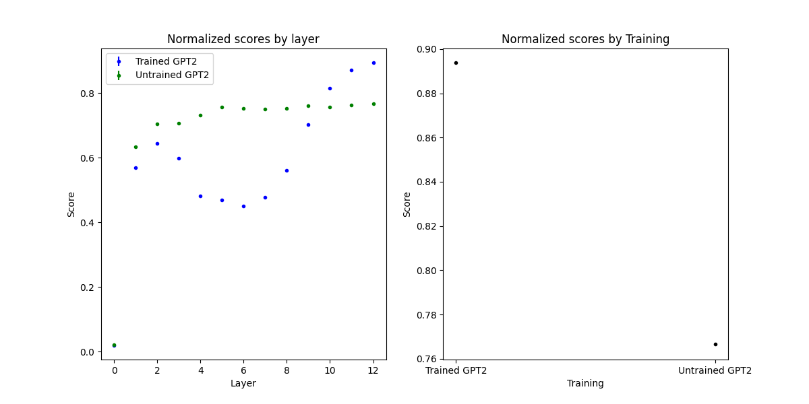

# coms6998-project
Transformer Lobotomy

# Installation
Clone this repository and run

```
cd coms6998-project
pip install .
```

It is recommended to create and install into a virtual environment by cloning the repository, creating the virtual environment, 
and then installing.
```
cd coms6998-project
python3 -m venv .venv  # Create a virtual environment named .venv
source .venv/bin/activate
pip install .
```

# Running

To run a scoring script, simply run
```
cd candbproj/experiments
python gpt2_trained.py
```
This will score the trained GPT2 model 10 times, each with a different random seed. 
To run a different number of times, each with a different random seed, do
```
python gpt2_trained.py -n <n>
```

Each script will attempt to load results from the `coms6998-project/results` directory if they exist. Otherwise, results
will be written to the `coms6998-project/results` directory once all results are completed, if the directory exists.
Results files are python pickle files and have the extension `.pkl`

Runs can take a long time. Scoring a model one time takes approximately 4 minutes on Intel i7 9700K CPU (3.60 GHz). 
Individual scripts vary from 10 to 150 scores computed. Instead, results files can be accessed on our 
[Google Drive](https://drive.google.com/drive/folders/1BYwleiFMlfdR5dkIc6uAjbHeZSvjvioM?usp=sharing) (A LionMail 
account is required to view).

# Analysis of results

To produce the plots found in the report, first results files must exist in `coms6998-project/results`. These can either
be generated by running all scoring scripts again (see [Running](#Running)) or they can be accessed on our 
[Google Drive](https://drive.google.com/drive/folders/1BYwleiFMlfdR5dkIc6uAjbHeZSvjvioM?usp=sharing) (A LionMail 
account is required to view). The result files are not committed to github due to their size.

```
# ensure you have the appropriate files in the results directory
$ ls coms6998-project/results
gpt2_char_tokenizer_result.pkl
gpt2_coarse_pos_ner_pos_result.pkl
gpt2_coarse_pos_result.pkl
gpt2_disable_attn_proj_lobotomy_result.pkl
gpt2_disable_key_proj_lobotomy_result.pkl
gpt2_disable_layer_norm_lobotomy_result.pkl
gpt2_disable_mlp_lobotomy_result.pkl
gpt2_disable_query_proj_lobotomy_result.pkl
gpt2_disable_value_proj_lobotomy_result.pkl
gpt2_fine_pos_ner_pos_result.pkl
gpt2_fine_pos_result.pkl
gpt2_ipa_char_tokenizer_result.pkl
gpt2_mfcc_embeddings_result.pkl
gpt2_n_inner_down_lobotomy_result.pkl
gpt2_n_inner_same_lobotomy_result.pkl
gpt2_n_inner_up_lobotomy_result.pkl
gpt2_no_pos_embed_lobotomy_result.pkl
gpt2_no_res_conns_lobotomy_result.pkl
gpt2_no_scaled_attn_lobotomy_result.pkl
gpt2_random_init_result.pkl
gpt2_trained_result.pkl
gpt2_varied_attn_heads_result.pkl
gpt2_varied_attn_pdrop_dropout_result.pkl
gpt2_varied_embd_pdrop_dropout_result.pkl
gpt2_varied_embeddings_result.pkl
gpt2_varied_embeddings_result_wrong.pkl
gpt2_varied_resid_pdrop_dropout_result.pkl
README.md
```

Once results files exist, you can run the appropriate script to produce a plot.

```
cd candproj/analyze/
python gpt2_trained_and_untrained_analysis.py
```



# Pre-generated Plots

Plots that were used in the final report are available in `candbproj/analyze/images/`
